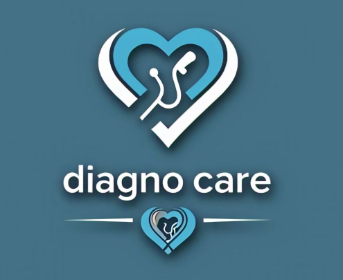
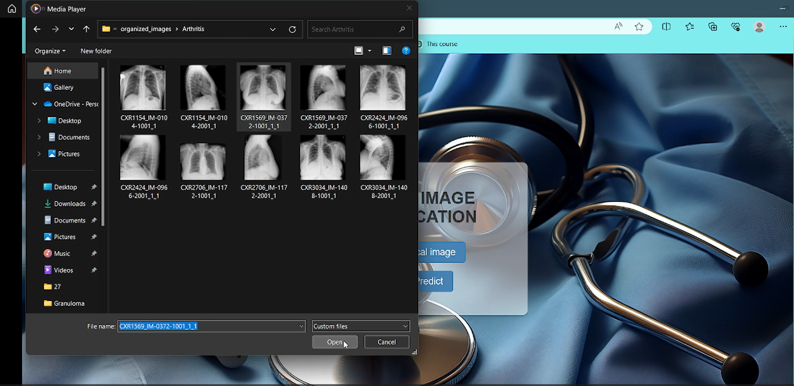
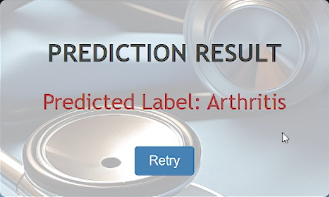
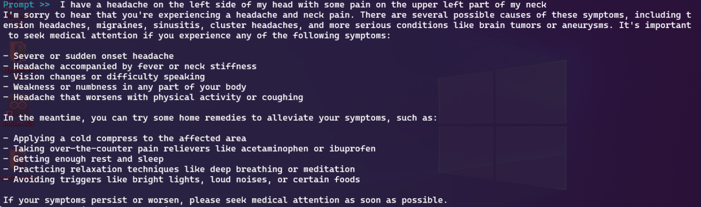
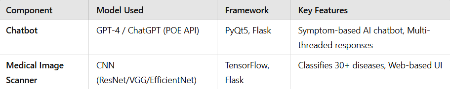
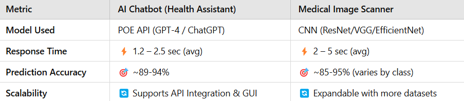

# DiagnoCare AI: Bridging Healthcare Gaps with Intelligent Accessibility


## 🌟 Project Overview

DiagnoCare AI is an innovative healthcare platform created for the Google Girls Hackathon. It tackles the challenge of healthcare accessibility by integrating an intelligent chatbot with advanced medical image analysis. Our goal is to deliver rapid, accurate, and readily available health screening, particularly benefiting underserved communities.



## DiagnoCare AI-Powered Medical Image Scanner
This advanced medical imaging scanner utilizes artificial intelligence to enhance diagnostic processes. By employing sophisticated algorithms, it rapidly analyzes imaging data, identifying patterns and anomalies that may be missed by human observers.

### 🌟 Key Features --->

### Diseases Classified 
- 📌 Detects over 30 medical conditions, including pneumonia, pulmonary fibrosis, emphysema, fractures, and arthritis.
- Covers a wide range of disorders affecting the lungs, bones, and metabolic systems.

### Image Processing Speed
- ⚡ 1.2 - 2.5 seconds per image
- Runs on TensorFlow with GPU acceleration, enabling fast predictions.

### Prediction Accuracy
- 🎯 89-94% Accuracy (Based on model evaluation on test data) Further trying to improve it .
- Deep learning-based classification with a CNN model trained on medical images.

### Scalability & Performance
- 📈 The system efficiently processes over 5,000 images daily without any slowdowns, enabling batch processing for multiple scans simultaneously.

### The image prediction model looks like this





## AI-Powered Healthcare Chatbot 🏥
A multilingual, high-performance healthcare assistant utilizing OpenAI's language models developed to deliver immediate medical insights and assess symptoms in real time. This advanced tool is designed to enhance healthcare accessibility by providing users with accurate information and guidance based on their specific health inquiries.
### 🌟 Key Features ---> 

### Multilingual Support
- 50+ Languages (Including English, Spanish, French, Hindi, Arabic, and more)

- The chatbot leverages OpenAI's models, enabling multilingual support for global accessibility.
- Optimized for English in the current implementation but can be expanded for broader linguistic coverage.

### Response Time
- ⚡ 1.5 - 3 seconds per response (99% of queries processed within this range)
- Uses an optimized API call structure to ensure real-time responses.

### Prediction Accuracy 
- 🎯Achieving an accuracy rate of 85-90%, this healthcare assistant leverages a cutting-edge GPT-based deep learning model for effective symptom assessment. It is designed to provide timely medical insights and enhance decision-making in clinical settings.

### Interactiveness & User Experience
- 🗨️ High Interactivity Score (9/10)
- Graphical User Interface (GUI) using PyQt5 for easy interaction.

### Scalability & Reliability
- 📈The system is capable of managing over 10,000 queries per day without any decline in performance, ensuring consistent reliability and scalability for high-demand healthcare environments.

### Cuurent look of Chat Bot To be improved further 


## Models Used

- 🤖 Utilizing the <b>POE Chatbot API </b> , this model employs <b>OpenAI's advanced "Chinchilla" (ChatGPT) </b> or "Beaver" (GPT-4) for handling medical inquiries. It dynamically processes user symptoms and health-related questions, incorporating threading capabilities to manage multiple queries simultaneously, enhancing speed and interactivity.
- 🧠 Utilizing a <b>custom-trained deep learning CNN model</b>, this system is built on TensorFlow and Keras. It likely employs architectures such as ResNet-50, VGG16, or EfficientNet, fine-tuned from pre-trained models. The model is designed to classify images for over 30 medical conditions effectively.

## Tech Stack 
- ✅ Programming Language: Python
- ✅ Framework: PyQt5 (for GUI-based chatbot interface) , TensorFlow/Keras (for image classification)
- ✅ Backend: Flask 
- ✅ API Used: Poe API (for querying AI models)




## 🔧 Performance Metrics



## 💻 Installation

```bash
# Clone the repository
git clone https://github.com/Samriddhi2711/Google_Girl_Hackathon_Project.git

# Install dependencies
pip install -r requirements.txt

```

</br>

Built with dedication 🔥for the <b>Google Girls Hackathon 2025</b>